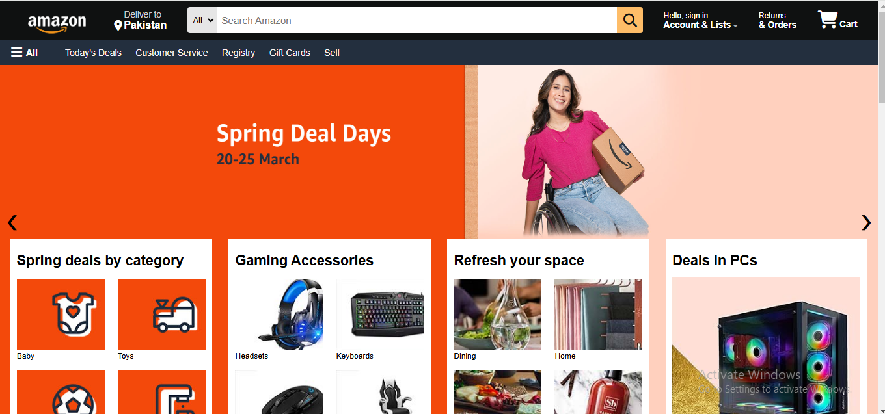

# Amazon Clone

## Description
This project is a fully responsive **Amazon Clone** designed to replicate the core design and features of Amazon's website. It includes an interactive hero section, product sliders, a responsive navbar, and a multi-level footer. Built using **HTML**, **CSS**, and **JavaScript**, this clone prioritizes responsiveness, interactivity, and user-friendly design.

---

## Screenshot


---

## Live Demo
[View the live project here!](https://laibatariq110.github.io/React-Color-Picker)

---

## Features

### 1. Hero Section Image Slider
- Automatically cycles through featured images every 5 seconds.
- Smooth and visually appealing transitions.
- Includes manual navigation functionality.

### 2. Toy Product Slider
- Dynamically adjusts the number of visible images based on screen size.
- Provides seamless navigation with looping functionality.
- Ensures smooth transitions for an enhanced browsing experience.

### 3. Responsive Navbar
- Traditional navbar for larger screens.
- Hamburger menu for smaller devices, toggled by a button click.
- Ensures easy navigation across all screen sizes.

### 4. Multi-Level Footer
- Inspired by Amazon's footer, it includes:
  - A "Back to Top" section.
  - Informative sections with links.
  - Options for selecting language and currency.
  - Copyright information at the bottom.

---

## Technologies Used
- **HTML**: To structure the webpage.
- **CSS**: For styling and layout, including responsiveness.
- **JavaScript**: To add interactivity and dynamic features.

---

## Project Structure
Root ├── index.html # Main HTML file ├── styles.css # Main CSS file ├── script.js # JavaScript file for interactivity ├── various images used in the project └── README.md # Project documentation

---

## Setup Instructions
1. Clone this repository:
   ```bash
   git clone https://laibatariq110.github.io/Amazon-Clone.git
   ```
2. Open the `index.html` file in a browser to view the project.

---

## Usage
- **Navigate the Website**: Use the navbar to navigate to different sections.
- **Hero Section Slider**: Enjoy the automatic image transitions or navigate manually.
- **Toy Slider**: Browse toy images with a dynamic, responsive slider.
- **Footer Options**: Access language, currency, and other options.

---

## Acknowledgments
This project is a simplified clone for educational purposes and is not affiliated with or endorsed by Amazon.
